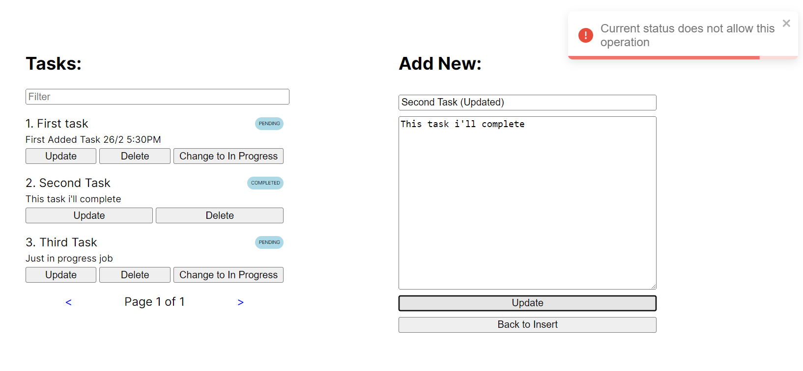

# Database

The entire development and test was using MySQL docker image.

> docker run --rm --name mysql -e MYSQL_ROOT_PASSWORD=passwd_123 -p 3306:3306 -p 33060:33060 mysql

Before start the server, run the schema prepare

> docker exec -it mysql mysql -u root -p

And enter the root password `passwd_123`.  
After it follow the `resources/database.sql` commands to prepare the environment

# Backend

In order to start backend, just run the command above at root of project folder:

> mvn spring-boot::run

When the console prints `Started TodolistMeistersApplication in 3.205 seconds (process running for 3.409)`, its running

# Frontend

Go to frontend folder

> cd src/main/frontend

Download node modules

> npm i

And start the nextjs app

> npx next dev

After it just open a browser and go to

> http://localhost:3000/

# Environment used

NodeJS: v18.17.0
NPM: v9.6.7

Maven: v3.5.4
Java: JDK v17.0.9